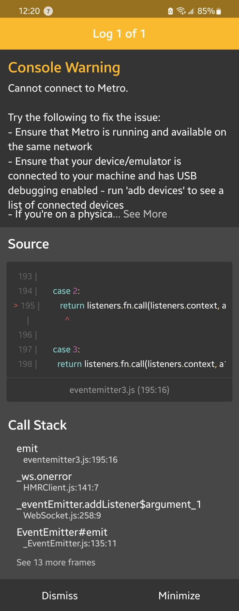

# stanley-tree-react

# Installation and Usage

##1. install expo and yarn
##2. Run Server
1. git clone repo into directory
2. install dependencies using `yarn install`
3. run using `expo start`
4. to access Metro Bundler Server UI, go to http://localhost:19002/

On success, the console should look something like this: 

With the Metro Bundler UI looking something like this: 

##3. Run App
1. To run on web, click "Run in web browser" from the Server or press "w" from the console to initiate the app in a web browser
2. To run on physical mobile device
    1. Install Expo from Google Play Store or Apple App Store
    2. with the server running, scan the QR code that gets generated by the server to add the project: 
    3. If step above doesn't work, then in Expo enter this URI to add the project:  
       `exp://ne-v6u.anonymous.sts-react-app.exp.direct:80`
       

## Common Issues and bugs

A common issue is the device disconnecting from the server, the device running expo may get this message pop up

- This happens when there has been a disruption in the server's live connection to the device, most common when running a tunnel connection
    - If this connection is interrupted, the user won't see live updates.
    - To resolve this: restart expo on the device and let expo redownload the app bundles
    - To prevent this: Until the app is deployed, it is best to test and run with a device that's on the same network as the server
        